# ConsorciosPro — Modelo de Datos (ERD)

**Versión:** 1.2
**Fecha:** 2026-03-23

---

## Diagrama Entidad-Relación

```mermaid
erDiagram
    USERS {
        bigint id PK
        string name
        string email UK
        string password
        timestamp email_verified_at
        timestamps timestamps
    }

    CONSORCIOS {
        bigint id PK
        string nombre
        string direccion
        string cuit UK
        string banco "default ROELA S.A"
        string nro_cuenta_bancaria
        string convenio
        string sucursal
        string digito_verificador
        string cbu
        enum condicion_iva "no_alcanzado|exento|responsable_inscripto"
        string nro_cuenta_rentas
        string nomenclatura_catastral
        string nro_matricula
        date fecha_inscripcion_reglamento
        string unidad_facturacion_aguas
        boolean tiene_cocheras "default false"
        string encargado_nombre
        string encargado_apellido
        string encargado_telefono
        text encargado_horarios
        text encargado_dias
        string encargado_empresa_servicio
        string nombre_administracion
        string logo_administracion
        text texto_medios_pago
        integer dia_primer_vencimiento
        integer dia_segundo_vencimiento
        decimal recargo_segundo_vto "5,2"
        text nota
        boolean activo "default true"
        timestamps timestamps
        softDeletes deleted_at
    }

    UNIDADES {
        bigint id PK
        bigint consorcio_id FK
        string numero
        string nro_ph
        decimal coeficiente "precision 8,6"
        string nomenclatura_catastral
        string nro_cuenta_rentas
        boolean tiene_cochera "default false"
        string nro_cochera
        enum estado_ocupacion "propietario_residente|inquilino|desocupado"
        string nro_cupon_siro
        string codigo_pago_electronico
        enum recibos_a_nombre_de "propietario|inmobiliaria|dueno"
        enum condicion_iva "consumidor_final|responsable_inscripto|exento"
        string email_expensas_ordinarias "500 chars"
        string email_expensas_extraordinarias "500 chars"
        boolean activo "default true"
        timestamps timestamps
        softDeletes deleted_at
    }

    PROPIETARIOS {
        bigint id PK
        bigint unidad_id FK
        string nombre
        string dni
        string direccion_postal "500 chars"
        string email "500 chars"
        string telefono "200 chars"
        timestamps timestamps
    }

    INQUILINOS {
        bigint id PK
        bigint unidad_id FK
        string nombre
        string apellido
        string telefono "200 chars"
        string email "500 chars"
        string direccion_postal "500 chars"
        date fecha_fin_contrato
        boolean activo "default true"
        timestamps timestamps
    }

    INMOBILIARIAS {
        bigint id PK
        bigint unidad_id FK
        string nombre
        string apellido
        string telefono "200 chars"
        string email "500 chars"
        string direccion "500 chars"
        timestamps timestamps
    }

    CONTACTOS_ALTERNATIVOS {
        bigint id PK
        string contactable_type "propietario|inquilino"
        bigint contactable_id
        string nombre
        string telefono "200 chars"
        string email "500 chars"
        timestamps timestamps
    }

    CONJUNTOS_COEFICIENTES {
        bigint id PK
        bigint consorcio_id FK
        string nombre
        boolean es_default "default false"
        timestamps timestamps
    }

    COEFICIENTES_UNIDAD {
        bigint id PK
        bigint conjunto_id FK
        bigint unidad_id FK
        decimal coeficiente "8,6"
        timestamps timestamps
    }

    PRESUPUESTOS {
        bigint id PK
        bigint consorcio_id FK
        date periodo "YYYY-MM-01"
        enum estado "borrador|finalizado|liquidado"
        bigint presupuesto_anterior_id FK "nullable, referencia al mes anterior"
        text notas
        timestamps timestamps
        softDeletes deleted_at
    }

    CONCEPTO_PRESUPUESTOS {
        bigint id PK
        bigint presupuesto_id FK
        bigint gasto_id FK "nullable, vincula con factura real"
        string nombre
        enum rubro "servicios|mantenimiento|sueldos|impuestos|seguros|otros"
        text descripcion
        decimal monto_total "12,2 monto estimado"
        integer cuotas_total "default 1"
        integer cuota_actual "default 1"
        enum tipo "ordinario|extraordinario"
        decimal monto_factura_real "12,2 nullable, NULL=aun estimado"
        integer orden "para ordenar en la lista"
        timestamps timestamps
    }

    LIQUIDACIONES {
        bigint id PK
        bigint presupuesto_id FK
        bigint consorcio_id FK
        date periodo
        enum estado "borrador|generada|cerrada"
        decimal total_ordinario "12,2"
        decimal total_extraordinario "12,2"
        decimal total_general "12,2"
        date fecha_primer_vto
        date fecha_segundo_vto
        decimal monto_segundo_vto "12,2"
        timestamps timestamps
        softDeletes deleted_at
    }

    LIQUIDACION_CONCEPTOS {
        bigint id PK
        bigint liquidacion_id FK
        bigint concepto_presupuesto_id FK
        string nombre "snapshot"
        decimal monto_total "12,2 snapshot"
        enum tipo "ordinario|extraordinario snapshot"
        enum metodo_distribucion "coeficiente|partes_iguales|manual"
        bigint conjunto_coeficiente_id FK "nullable, para metodo coeficiente"
        timestamps timestamps
    }

    LIQUIDACION_DETALLES {
        bigint id PK
        bigint liquidacion_concepto_id FK
        bigint unidad_id FK
        decimal coeficiente_aplicado "8,6"
        decimal monto_calculado "12,2"
        boolean excluido "default false"
        decimal porcentaje_manual "8,6 nullable"
        timestamps timestamps
    }

    PROVEEDORES {
        bigint id PK
        string nombre
        string cuit
        string telefono
        string email
        string direccion
        text notas
        boolean activo "default true"
        timestamps timestamps
        softDeletes deleted_at
    }

    GASTOS {
        bigint id PK
        bigint consorcio_id FK
        bigint proveedor_id FK "nullable"
        bigint concepto_presupuesto_id FK "nullable"
        string nro_orden
        string descripcion
        decimal importe "12,2"
        date fecha_factura
        string periodo
        enum estado "pendiente|pagado"
        date fecha_pago "nullable"
        string comprobante_pago "nullable, path al archivo"
        string factura_archivo "nullable, path al archivo"
        text notas
        timestamps timestamps
        softDeletes deleted_at
    }

    CONSORCIOS ||--o{ UNIDADES : "tiene muchas"
    UNIDADES ||--o| PROPIETARIOS : "tiene un"
    UNIDADES ||--o| INQUILINOS : "puede tener un"
    UNIDADES ||--o| INMOBILIARIAS : "puede tener una"
    PROPIETARIOS ||--o{ CONTACTOS_ALTERNATIVOS : "tiene muchos"
    INQUILINOS ||--o{ CONTACTOS_ALTERNATIVOS : "tiene muchos"
    CONSORCIOS ||--o{ CONJUNTOS_COEFICIENTES : "define"
    CONJUNTOS_COEFICIENTES ||--o{ COEFICIENTES_UNIDAD : "contiene"
    COEFICIENTES_UNIDAD }o--|| UNIDADES : "aplica a"
    CONSORCIOS ||--o{ PRESUPUESTOS : "tiene muchos"
    PRESUPUESTOS ||--o{ CONCEPTO_PRESUPUESTOS : "contiene"
    PRESUPUESTOS ||--o| PRESUPUESTOS : "clona de anterior"
    PRESUPUESTOS ||--o| LIQUIDACIONES : "genera una"
    LIQUIDACIONES ||--o{ LIQUIDACION_CONCEPTOS : "contiene"
    CONJUNTOS_COEFICIENTES ||--o{ LIQUIDACION_CONCEPTOS : "usado en"
    LIQUIDACION_CONCEPTOS ||--o{ LIQUIDACION_DETALLES : "detalla por unidad"
    LIQUIDACION_DETALLES }o--|| UNIDADES : "pertenece a"
    CONSORCIOS ||--o{ GASTOS : "registra"
    PROVEEDORES ||--o{ GASTOS : "emite"
    CONCEPTO_PRESUPUESTOS ||--o{ GASTOS : "se vincula con"
```



> **Nota sobre multi-tenancy:** El modelo actual es single-tenant. Para futura comercialización, se agregará un campo `tenant_id` a las tablas principales y middleware de scope automático. La arquitectura ya está preparada para esta extensión.

---

## Detalles de Diseño por Tabla

### Estimados vs Confirmados

El campo `monto_factura_real` en `concepto_presupuestos` determina el estado del concepto:
- `monto_factura_real IS NULL` → El concepto **aún es estimado**, no llegó la factura
- `monto_factura_real IS NOT NULL` → El concepto está **confirmado** con factura real
- `gasto_id` vincula con el registro del gasto/factura específico

**TODOS los conceptos inician como estimados.** No existe un flag booleano separado.

### Snapshots en Liquidación

Las tablas `liquidacion_conceptos` y `liquidacion_detalles` almacenan **snapshots** (copias) de los datos al momento de generar la liquidación. Esto es crucial porque:

1. Si se modifica un presupuesto después de liquidar, la liquidación histórica **no cambia**
2. Si cambia el coeficiente de una unidad, las liquidaciones anteriores mantienen el valor original
3. Permite auditoría completa de cada liquidación generada

Además, cuando un concepto se liquida por coeficiente, se almacena `conjunto_coeficiente_id` para dejar trazabilidad del conjunto utilizado (ej: Reglamento, Cocheras).

### Relación Presupuesto → Presupuesto Anterior

El campo `presupuesto_anterior_id` permite:
1. Clonar conceptos del mes anterior como base para el nuevo presupuesto
2. Calcular automáticamente ajustes (diferencia entre estimado y factura real)
3. Mantener trazabilidad del historial de presupuestos

### Cuotas en Conceptos

El sistema de cuotas funciona así:
- `cuotas_total = 3` → El gasto se paga en 3 meses
- `cuota_actual = 2` → Este presupuesto incluye la cuota 2 de 3
- Al clonar al mes siguiente: `cuota_actual` se incrementa automáticamente
- Cuando `cuota_actual > cuotas_total`, el concepto **no se incluye** en el nuevo presupuesto

### Soft Deletes

Las tablas principales usan `SoftDeletes` para:
- No perder datos históricos vinculados a liquidaciones
- Permitir "deshacer" eliminaciones
- Mantener integridad referencial con registros históricos

---

## Índices Recomendados

```sql
-- Búsquedas frecuentes
CREATE INDEX idx_consorcios_cuit ON consorcios(cuit);
CREATE INDEX idx_consorcios_nombre ON consorcios(nombre);
CREATE INDEX idx_unidades_consorcio ON unidades(consorcio_id);
CREATE INDEX idx_unidades_numero ON unidades(consorcio_id, numero);
CREATE INDEX idx_presupuestos_periodo ON presupuestos(consorcio_id, periodo);
CREATE INDEX idx_liquidaciones_periodo ON liquidaciones(consorcio_id, periodo);
CREATE INDEX idx_gastos_consorcio ON gastos(consorcio_id, estado);
CREATE INDEX idx_gastos_periodo ON gastos(consorcio_id, periodo);
```
