# ConsorciosPro — Modelo de Datos (ERD)

**Versión:** 1.4  
**Fecha:** 2026-05-04  
**Notas de cambio:** Campos de ciclo de vida de archivos en `gastos`; se mantiene el pivot `gasto_concepto_presupuesto` sin `observaciones`; notas de diseño sobre nomenclatura automática, devengado/percibido y archivo local.

---

## Diagrama Entidad-Relación

```mermaid
erDiagram
    USERS {
        bigint id PK
        string name
        string email UK
        string password
        timestamp email_verified_at
        timestamps timestamps
    }

    CONSORCIOS {
        bigint id PK
        string nombre
        string direccion
        string cuit UK
        string banco "default ROELA S.A"
        string nro_cuenta_bancaria
        string convenio
        string sucursal
        string digito_verificador
        string cbu
        enum condicion_iva "no_alcanzado|exento|responsable_inscripto"
        string nro_cuenta_rentas
        string nomenclatura_catastral
        string nro_matricula "SRS matricula reglamento"
        date fecha_inscripcion_reglamento
        string unidad_facturacion_aguas
        boolean tiene_cocheras "default false"
        string encargado_nombre
        string encargado_apellido
        string encargado_telefono
        text encargado_horarios
        text encargado_dias
        string encargado_empresa_servicio
        string nombre_administracion
        string logo_administracion
        text texto_medios_pago
        integer dia_primer_vencimiento
        integer dia_segundo_vencimiento
        decimal recargo_segundo_vto "5,2"
        text nota
        boolean activo "default true"
        timestamps timestamps
        softDeletes deleted_at
    }

    UNIDADES {
        bigint id PK
        bigint consorcio_id FK
        string numero
        string nro_ph
        decimal coeficiente "precision 8,6"
        string nomenclatura_catastral
        string nro_cuenta_rentas
        boolean tiene_cochera "default false"
        string nro_cochera
        enum estado_ocupacion "propietario_residente|inquilino|desocupado"
        string nro_cupon_siro
        string codigo_pago_electronico
        enum recibos_a_nombre_de "propietario|inmobiliaria|dueno"
        enum condicion_iva "consumidor_final|responsable_inscripto|exento"
        string email_expensas_ordinarias "500 chars"
        string email_expensas_extraordinarias "500 chars"
        boolean activo "default true"
        timestamps timestamps
        softDeletes deleted_at
    }

    PROPIETARIOS {
        bigint id PK
        bigint unidad_id FK
        string nombre
        string dni
        string direccion_postal "500 chars"
        string email "500 chars"
        string telefono "200 chars"
        timestamps timestamps
    }

    INQUILINOS {
        bigint id PK
        bigint unidad_id FK
        string nombre
        string apellido
        string telefono "200 chars"
        string email "500 chars"
        string direccion_postal "500 chars"
        date fecha_fin_contrato
        boolean activo "default true"
        timestamps timestamps
    }

    INMOBILIARIAS {
        bigint id PK
        bigint unidad_id FK
        string nombre
        string apellido
        string telefono "200 chars"
        string email "500 chars"
        string direccion "500 chars"
        timestamps timestamps
    }

    CONTACTOS_ALTERNATIVOS {
        bigint id PK
        string contactable_type "Morph: Propietario|Inquilino"
        bigint contactable_id
        string nombre
        string telefono "200 chars"
        string email "500 chars"
        timestamps timestamps
    }

    CONJUNTOS_COEFICIENTES {
        bigint id PK
        bigint consorcio_id FK
        string nombre
        boolean es_default "default false"
        timestamps timestamps
    }

    COEFICIENTES_UNIDAD {
        bigint id PK
        bigint conjunto_id FK
        bigint unidad_id FK
        decimal coeficiente "8,6"
        timestamps timestamps
    }

    PRESUPUESTOS {
        bigint id PK
        bigint consorcio_id FK
        date periodo "YYYY-MM-01"
        enum estado "borrador|finalizado|liquidado"
        bigint presupuesto_anterior_id FK "nullable, referencia al mes anterior"
        integer dia_primer_vencimiento_aplicado "1-28 real este mes"
        integer dia_segundo_vencimiento_aplicado "1-28 real este mes"
        decimal recargo_mensual_aplicado "5,2 interes mensual para calculo cupon este mes"
        text notas
        timestamps timestamps
        softDeletes deleted_at
    }

    CONCEPTO_PRESUPUESTOS {
        bigint id PK
        bigint presupuesto_id FK
        string nombre
        enum rubro "servicios|mantenimiento|sueldos|impuestos|seguros|otros"
        text descripcion
        decimal monto_total "12,2 monto estimado"
        integer cuotas_total "default 1"
        integer cuota_actual "default 1"
        enum tipo "ordinario|extraordinario"
        boolean aplica_cocheras "default false"
        decimal monto_factura_real "12,2 nullable, NULL=aun estimado"
        integer orden "para ordenar en la lista"
        timestamps timestamps
    }

    GASTO_CONCEPTO_PRESUPUESTO {
        bigint id PK
        bigint gasto_id FK
        bigint concepto_presupuesto_id FK
        decimal importe_asignado "12,2"
        timestamps timestamps
    }

    LIQUIDACIONES {
        bigint id PK
        bigint presupuesto_id FK
        bigint consorcio_id FK
        date periodo
        enum estado "borrador|generada|cerrada"
        decimal total_ordinario "12,2"
        decimal total_extraordinario "12,2"
        decimal total_general "12,2"
        date fecha_primer_vto
        date fecha_segundo_vto
        decimal monto_segundo_vto "12,2"
        timestamps timestamps
        softDeletes deleted_at
    }

    LIQUIDACION_CONCEPTOS {
        bigint id PK
        bigint liquidacion_id FK
        bigint concepto_presupuesto_id FK
        string nombre "snapshot"
        decimal monto_total "12,2 snapshot"
        enum tipo "ordinario|extraordinario snapshot"
        enum metodo_distribucion "coeficiente|partes_iguales|manual"
        bigint conjunto_coeficiente_id FK "nullable, para metodo coeficiente"
        timestamps timestamps
    }

    LIQUIDACION_DETALLES {
        bigint id PK
        bigint liquidacion_concepto_id FK
        bigint unidad_id FK
        decimal coeficiente_aplicado "8,6"
        decimal monto_calculado "12,2"
        boolean excluido "default false"
        decimal porcentaje_manual "8,6 nullable"
        timestamps timestamps
    }

    PROVEEDORES {
        bigint id PK
        string nombre
        string cuit
        string telefono
        string email
        string direccion
        text notas
        boolean activo "default true"
        timestamps timestamps
        softDeletes deleted_at
    }

    GASTOS {
        bigint id PK
        bigint consorcio_id FK
        bigint proveedor_id FK "nullable"
        string nro_orden
        string descripcion "500 chars"
        decimal importe "12,2 total comprobante"
        date fecha_factura
        date periodo "YYYY-MM-01, normalizado al primer dia del mes"
        enum estado "pendiente|pagado"
        date fecha_pago "nullable"
        string comprobante_pago "nullable, path al archivo"
        string factura_archivo "nullable, path en servidor"
        string factura_nombre_sistema "nullable, nombre renombrado automaticamente"
        boolean archivo_disponible_online "default true"
        date fecha_archivado_local "nullable, cuando se bajo y borro del servidor"
        text notas
        timestamps timestamps
        softDeletes deleted_at
    }

    CONSORCIOS ||--o{ UNIDADES : "tiene muchas"
    UNIDADES ||--o| PROPIETARIOS : "tiene un"
    UNIDADES ||--o| INQUILINOS : "puede tener un"
    UNIDADES ||--o| INMOBILIARIAS : "puede tener una"
    PROPIETARIOS ||--o{ CONTACTOS_ALTERNATIVOS : "tiene muchos"
    INQUILINOS ||--o{ CONTACTOS_ALTERNATIVOS : "tiene muchos"
    CONSORCIOS ||--o{ CONJUNTOS_COEFICIENTES : "define"
    CONJUNTOS_COEFICIENTES ||--o{ COEFICIENTES_UNIDAD : "contiene"
    COEFICIENTES_UNIDAD }o--|| UNIDADES : "aplica a"
    CONSORCIOS ||--o{ PRESUPUESTOS : "tiene muchos"
    PRESUPUESTOS ||--o{ CONCEPTO_PRESUPUESTOS : "contiene"
    PRESUPUESTOS ||--o| PRESUPUESTOS : "clona de anterior"
    PRESUPUESTOS ||--o| LIQUIDACIONES : "genera una"
    LIQUIDACIONES ||--o{ LIQUIDACION_CONCEPTOS : "contiene"
    CONJUNTOS_COEFICIENTES ||--o{ LIQUIDACION_CONCEPTOS : "usado en"
    LIQUIDACION_CONCEPTOS ||--o{ LIQUIDACION_DETALLES : "detalla por unidad"
    LIQUIDACION_DETALLES }o--|| UNIDADES : "pertenece a"
    CONSORCIOS ||--o{ GASTOS : "registra"
    PROVEEDORES ||--o{ GASTOS : "emite"
    GASTOS ||--o{ GASTO_CONCEPTO_PRESUPUESTO : "reparto"
    CONCEPTO_PRESUPUESTOS ||--o{ GASTO_CONCEPTO_PRESUPUESTO : "recibe imputacion"
```



> **Nota sobre multi-tenancy:** El modelo actual es single-tenant. Para futura comercialización, se agregará un campo `tenant_id` a las tablas principales y middleware de scope automático. La arquitectura ya está preparada para esta extensión.

---

## Detalles de Diseño por Tabla

### Valores nominales (consorcio) vs reales del mes (presupuesto)

En `consorcios` viven los **valores nominales** de referencia: días de 1er/2do vencimiento y `%` recargo de 2do vencimiento (interés mensual usado en la base del cálculo diario).

En cada `presupuestos` se persisten los **valores aplicados ese mes** (`dia_*_vencimiento_aplicado`, `recargo_mensual_aplicado`), inicializados desde el consorcio y editables para el período (SRS §2.3).

### Estimados vs confirmados y vínculo con facturas

El campo `monto_factura_real` en `concepto_presupuestos` determina el estado del concepto:
- `monto_factura_real IS NULL` → El concepto **aún es estimado**, no llegó la factura
- `monto_factura_real IS NOT NULL` → El concepto está **confirmado** con importe real imputado

**TODOS los conceptos inician como estimados.** No existe un flag booleano separado.

Un mismo **gasto/comprobante** (`gastos`) puede distribuirse en **varios conceptos** del presupuesto mediante `gasto_concepto_presupuesto` (importe por línea). La suma de `importe_asignado` por gasto debe cuadrar con `gastos.importe` (validación de negocio). Actualizar conceptos y disparar ajustes al mes siguiente sigue las reglas del SRS §2.3 y §2.6.

### Contactos alternativos

Los registros son **polimórficos** (`contactable_type` / `contactable_id`) hacia `propietarios` o `inquilinos`. El SRS habla de relación propietario/inquilino a nivel funcional; la implementación usa el modelo dueño del contacto (no un enum duplicado en la tabla).

### Conceptos y cocheras

`aplica_cocheras` en `concepto_presupuestos` indica si el concepto sugiere el conjunto de coeficientes «Cocheras» u opciones UI relacionadas (SRS §2.3–2.4).

### Snapshots en Liquidación

Las tablas `liquidacion_conceptos` y `liquidacion_detalles` almacenan **snapshots** (copias) de los datos al momento de generar la liquidación. Esto es crucial porque:

1. Si se modifica un presupuesto después de liquidar, la liquidación histórica **no cambia**
2. Si cambia el coeficiente de una unidad, las liquidaciones anteriores mantienen el valor original
3. Permite auditoría completa de cada liquidación generada

Además, cuando un concepto se liquida por coeficiente, se almacena `conjunto_coeficiente_id` para dejar trazabilidad del conjunto utilizado (ej: Reglamento, Cocheras).

### Relación Presupuesto → Presupuesto Anterior

El campo `presupuesto_anterior_id` permite:
1. Clonar conceptos del mes anterior como base para el nuevo presupuesto
2. Calcular automáticamente ajustes (diferencia entre estimado y factura real)
3. Mantener trazabilidad del historial de presupuestos

### Cuotas en Conceptos

El sistema de cuotas funciona así:
- `cuotas_total = 3` → El gasto se paga en 3 meses
- `cuota_actual = 2` → Este presupuesto incluye la cuota 2 de 3
- Al clonar al mes siguiente: `cuota_actual` se incrementa automáticamente
- Cuando `cuota_actual > cuotas_total`, el concepto **no se incluye** en el nuevo presupuesto

### Ciclo de vida de archivos adjuntos

Los archivos digitales (PDFs, imágenes) siguen este ciclo:

1. **Carga:** El sistema renombra el archivo automáticamente al subirlo, usando el patrón `[concepto-slug]_[AAAA-MM]_[consorcio-slug].[ext]` (ej. `luz_2025-10_edificio-san-martin.pdf`). Si la factura se imputa a varios conceptos se usa `"varios"` como slug. El nombre generado se guarda en `factura_nombre_sistema`; el nombre original no se conserva.
2. **Online (≤ 12 meses):** `archivo_disponible_online = true`. El archivo físico existe en el servidor y puede descargarse desde la interfaz.
3. **Alerta de vencimiento (mes 11):** El sistema muestra un banner en el listado de gastos cuando un archivo tiene entre 11 y 12 meses de antigüedad, con un botón para **descargar en ZIP todos los archivos próximos a vencer** de una vez.
4. **Archivado local:** El administrador descarga el archivo (individualmente o en lote), lo elimina del servidor y el sistema marca `archivo_disponible_online = false` con la `fecha_archivado_local`. El registro contable del gasto permanece intacto.
5. **Referencia histórica permanente:** El nombre del archivo (`factura_nombre_sistema`) queda en la base de datos para consultas futuras, permitiendo localizar el archivo en el soporte local con el nombre legible generado.

### Devengado vs. Percibido

El campo `estado` en `gastos` implementa la distinción contable:
- **`pendiente`** → Gasto **devengado**: la factura fue recibida y la obligación está contraída, pero aún no se pagó. Se refleja como deuda del consorcio con el proveedor.
- **`pagado`** → Gasto **percibido** (efectivizado): se registra la `fecha_pago` y el comprobante de pago. Se usa para la conciliación con saldos bancarios.

Esta distinción permite al informe económico mostrar tanto los egresos devengados del período como los efectivamente pagados, y facilita la conciliación con los extractos bancarios (SRS §2.6.5 y §2.7).

### Campo `periodo` en `gastos`

El campo `periodo` es de tipo `date` y se normaliza siempre al **primer día del mes** (`YYYY-MM-01`). La UI presenta y recibe el valor en formato `YYYY-MM` (input `type="month"`), y el sistema lo convierte antes de persistir. Este enfoque facilita las queries por rango de fechas, el ordenamiento y las operaciones con Carbon.

---

Las tablas principales usan `SoftDeletes` para:
- No perder datos históricos vinculados a liquidaciones
- Permitir "deshacer" eliminaciones
- Mantener integridad referencial con registros históricos

---

## Índices Recomendados

```sql
-- Búsquedas frecuentes
CREATE INDEX idx_consorcios_cuit ON consorcios(cuit);
CREATE INDEX idx_consorcios_nombre ON consorcios(nombre);
CREATE INDEX idx_unidades_consorcio ON unidades(consorcio_id);
CREATE INDEX idx_unidades_numero ON unidades(consorcio_id, numero);
CREATE INDEX idx_presupuestos_periodo ON presupuestos(consorcio_id, periodo);
CREATE INDEX idx_liquidaciones_periodo ON liquidaciones(consorcio_id, periodo);
CREATE INDEX idx_gastos_consorcio ON gastos(consorcio_id, estado);
CREATE INDEX idx_gastos_periodo ON gastos(consorcio_id, periodo);
CREATE INDEX idx_gasto_concepto_gasto ON gasto_concepto_presupuesto(gasto_id);
CREATE INDEX idx_gasto_concepto_concepto ON gasto_concepto_presupuesto(concepto_presupuesto_id);
```
