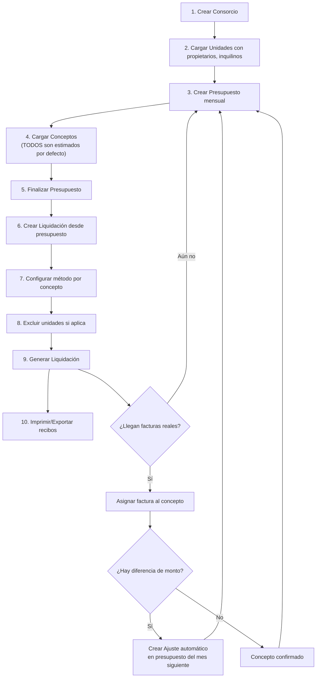
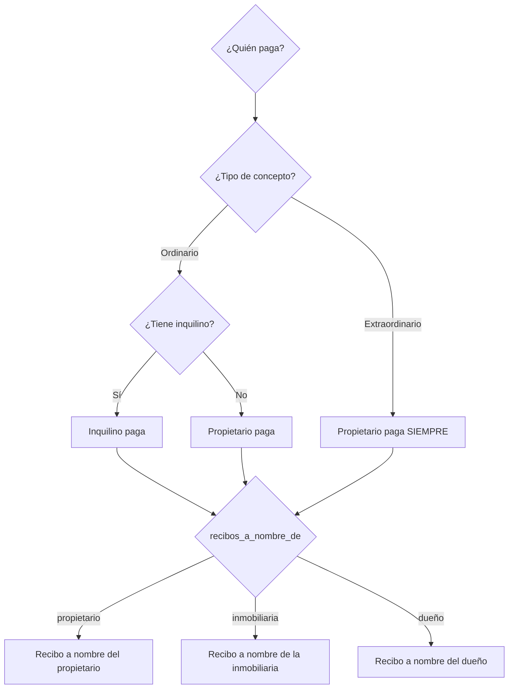

# ConsorciosPro — Reglas de Negocio y Flujos

**Versión:** 1.3  
**Fecha:** 2026-05-04  
**Notas de cambio:** Sección 4 ampliada: pantalla de carga con búsqueda por período, visualización del ajuste pendiente, observaciones en líneas de imputación, ciclo de vida de archivos (nomenclatura automática + archivo local a 12 meses), deudas a proveedores y lógica devengado/percibido.

---

## 1. Flujo Principal del Sistema



---

## 2. Reglas de Presupuestos

### 2.1 Creación
- Un presupuesto se crea para un consorcio + mes/año específico
- No pueden existir dos presupuestos para el mismo consorcio y período
- Estado inicial: `borrador`

### 2.2 Clonación del Mes Anterior
Cuando se genera un nuevo presupuesto:
1. Se busca el presupuesto del mes anterior del mismo consorcio
2. Se copian todos los conceptos con sus configuraciones
3. **Cuotas:** Si un concepto tiene `cuota_actual < cuotas_total`, se incrementa `cuota_actual`
4. **Cuotas terminadas:** Si `cuota_actual > cuotas_total`, el concepto **NO se copia**
5. **Ajustes automáticos:** Para cada concepto del mes anterior que recibió factura real (`monto_factura_real IS NOT NULL`), si hay diferencia con el monto estimado, se genera automáticamente un concepto "Ajuste [nombre]" con la diferencia
6. El concepto clonado conserva el monto estimado original (el usuario lo modifica según la nueva estimación del mes)

### 2.3 Ajustes por Estimados
```
Si monto_estimado = $1.000 y factura_real = $1.200:
  → Ajuste = +$200 (concepto nuevo en siguiente presupuesto)

Si monto_estimado = $1.000 y factura_real = $800:
  → Ajuste = -$200 (concepto de crédito/descuento en siguiente presupuesto)
```

### 2.4 Estados del Presupuesto
- **Borrador:** Se puede editar libremente
- **Finalizado:** No se puede editar. Listo para liquidar
- **Liquidado:** Se generó una liquidación. Inmutable

---

## 3. Reglas de Liquidación

### 3.1 Motor de Cálculo

Antes de calcular un concepto por coeficiente, el usuario selecciona el **conjunto de coeficientes** a utilizar (por ejemplo: Reglamento, Sin Locales, Cocheras).

#### Por Coeficiente
```
Para cada unidad participante en el concepto:
  coef_reprorrateado = coef_unidad / SUM(coef_todas_participantes)
  monto_unidad = monto_concepto × coef_reprorrateado

Verificación: SUM(monto_unidad) == monto_concepto (100%)
```

Reglas adicionales:
- Cada consorcio puede tener múltiples conjuntos de coeficientes nombrados.
- El conjunto por defecto es "Reglamento".
- Para gastos de cochera se puede usar conjunto "Cocheras".
- El conjunto elegido se guarda en la liquidación como snapshot.

**Ejemplo con exclusión:**
```
Unidades: A(3%), B(5%), C(2%) → Total: 10%
Si se excluye C del concepto "Ascensor" ($10.000):
  Coef reprorrateado A = 3 / (3+5) = 37.5%
  Coef reprorrateado B = 5 / (3+5) = 62.5%
  A paga: $10.000 × 0.375 = $3.750
  B paga: $10.000 × 0.625 = $6.250
  Total: $10.000 ✓
```

#### Por Partes Iguales
```
monto_unidad = monto_concepto / cantidad_unidades_participantes
```

#### Manual
```
Para cada unidad se define un porcentaje personalizado:
  monto_unidad = monto_concepto × (porcentaje_manual_unidad / 100)

Restricción: SUM(porcentaje_manual) debe ser EXACTAMENTE 100%
(El sistema debe validar esto antes de permitir guardar)
```

### 3.2 Generación de Recibos
- Concepto **ordinario** → Recibo dirigido al **inquilino** (o propietario si no hay inquilino)
- Concepto **extraordinario** → Recibo dirigido al **propietario** siempre
- El campo `recibos_a_nombre_de` de la unidad define a nombre de quién sale

### 3.3 Validaciones pre-liquidación
1. El presupuesto debe estar en estado `finalizado`
2. Todos los coeficientes de las unidades participantes deben sumar ~100% (con tolerancia de ±0.01)
3. No debe existir otra liquidación para el mismo consorcio y período
4. Cada concepto debe tener al menos 1 unidad asignada

### 3.4 Filtro exclusivo de cocheras (SRS §2.4)

Acceso directo en la pantalla de liquidación para trabajar gastos del sector cocheras sin incluir por error a UF sin cochera:

1. Al activarlo: **excluir automáticamente** unidades sin cochera (`tiene_cochera = false`).
2. **No** usar distribución por coeficiente en ese flujo (bloqueada): debe usarse **partes iguales** por defecto entre las UF participantes.
3. Se permite distribución **manual** si el usuario lo requiere.

---

## 4. Reglas de Gastos y Facturas

### 4.1 Pantalla de Carga — Diseño y Alcance (SRS §2.6.1)

- La **carga de comprobantes** es una pantalla **independiente** del armado del presupuesto. Su objetivo es simplificar la operatoria diaria del administrador.
- **Flujo de búsqueda por período:**
  1. El administrador selecciona el consorcio y el mes/año.
  2. El sistema muestra todos los conceptos de ese período con su monto estimado y su estado (sin factura / con factura asignada).
  3. El administrador selecciona el concepto y carga el comprobante (o lo distribuye en varios conceptos).
- No es necesario ingresar al flujo completo de edición del presupuesto para registrar una factura.

### 4.2 Vinculación Estimado → Real y Ajuste Automático (SRS §2.6.2)

1. Al asignar un comprobante real a uno o varios conceptos estimados, el sistema actualiza `monto_factura_real` en cada `concepto_presupuesto` imputado.
2. El sistema calcula la diferencia `monto_factura_real - monto_total` por concepto:
   ```
   Si monto_estimado = $1.000 y factura_real = $1.200:
     → Ajuste = +$200 (concepto nuevo "Ajuste [nombre]" en siguiente presupuesto)

   Si monto_estimado = $1.000 y factura_real = $800:
     → Ajuste = -$200 (crédito/descuento en siguiente presupuesto)
   ```
3. **Visualización de control en pantalla:** Antes de confirmar la carga, la pantalla muestra el concepto de ajuste que se va a generar (nombre, monto de la diferencia, período destino). El administrador puede verificar que el cálculo es correcto antes de guardar.
4. El ajuste se crea automáticamente en el presupuesto del mes siguiente al confirmar. Si ese presupuesto aún no existe, el ajuste queda en cola y se incorpora al crearlo.

### 4.3 Desglose en Múltiples Conceptos (SRS §2.6.3)

1. Una misma factura puede distribuirse en **N líneas de imputación** (`gasto_concepto_presupuesto`).
   - Ejemplo: Factura de mantenimiento de ascensores $15.000 → abono mensual $12.000 + reparación de puerta corrediza $3.000.
2. **Validación:** La suma de `importe_asignado` de todas las líneas debe ser **igual** al `importe` total del comprobante. El sistema bloquea el guardado si no cuadra.
3. **Observaciones por línea:** Cada línea puede tener un campo `observaciones` con texto libre (ej. "cambio de lámparas", "reparación de puerta corrediza"). Esta observación se traslada al informe económico del consorcista para dar contexto al gasto.

### 4.4 Registro, Estado y Pago

1. Registrar gasto: proveedor, importe total, período, descripción general, factura adjunta.
2. Asignar nro. de orden automático o manual.
3. Imputar importes a uno o más conceptos del presupuesto (con observaciones por línea).
4. Estado inicial: `pendiente` (**devengado** — obligación contraída, no pagada).
5. Al pagar: registrar fecha de pago + comprobante de pago adjunto → estado pasa a `pagado` (**percibido** — efectivizado).

### 4.5 Devengado vs. Percibido (SRS §2.6.5)

| Concepto | Estado en `gastos` | Descripción |
|---|---|---|
| **Devengado** | `pendiente` | Factura recibida, obligación contraída con el proveedor, aún no pagada. Aparece como deuda del consorcio. |
| **Percibido** | `pagado` | Pago efectuado y comprobado. Se usa para reconciliar con el extracto bancario. |

- Los informes económicos deben poder mostrar **ambas** perspectivas: egresos devengados del período y egresos efectivamente pagados.
- La **conciliación bancaria** se basa en los gastos `pagado` + sus fechas de pago, confrontados con los movimientos del extracto.

### 4.6 Ciclo de Vida de Archivos (SRS §2.6.4)

```
[Carga]  →  [Online ≤ 12 meses]  →  [Alerta mes 11]  →  [Descarga local/ZIP]  →  [Referencia histórica]
```

1. **Carga:** El administrador sube el PDF/imagen. El sistema lo renombra automáticamente:
   - Patrón: `[concepto-slug]_[AAAA-MM]_[consorcio-slug].[ext]`
   - Ejemplo: `luz_2025-10_edificio-san-martin.pdf`
   - Si se imputa a varios conceptos, se usa `"varios"` como slug del concepto.
   - El nombre generado se guarda en `factura_nombre_sistema`. El nombre original no se conserva.
2. **Online (≤ 12 meses):** `archivo_disponible_online = true`. El archivo existe físicamente en el servidor y es descargable desde la interfaz.
3. **Alerta de vencimiento (mes 11):** Cuando un archivo tiene entre 11 y 12 meses desde `fecha_factura`, el sistema muestra un banner en el listado de gastos: "Hay N facturas próximas a vencer su almacenamiento online."
4. **Descarga masiva:** El banner incluye un botón "Descargar todas" que genera un **ZIP** con todos los archivos próximos a vencer, nombrados con `factura_nombre_sistema`, para que el administrador los archive en un soporte local de una sola vez.
5. **Archivado local:** El administrador descarga el archivo (individualmente o en lote), lo elimina del servidor y el sistema marca:
   - `archivo_disponible_online = false`
   - `fecha_archivado_local = [fecha de la operación]`
   - El path `factura_archivo` se limpia (null).
6. **Referencia histórica permanente:** El registro del gasto (monto, proveedor, período, `factura_nombre_sistema`) permanece siempre en la base de datos. El administrador localiza el archivo físico en el soporte local usando el nombre legible guardado.

> **Criterio de los 12 meses:** Se cuenta desde `fecha_factura` del gasto.

### 4.7 Integración con Deudas a Proveedores (SRS §2.6.5)

- Cada gasto en estado `pendiente` constituye una **deuda del consorcio** con el proveedor correspondiente.
- El módulo de informes (SRS §2.7) puede listar los gastos pendientes de pago agrupados por proveedor, generando el **reporte de compromisos pendientes**.
- Al registrar el pago (`estado = pagado`), la deuda se cancela automáticamente en dicho reporte.

### 4.8 Rubros y Rendición

- Cada concepto de presupuesto debe tener un `rubro` (servicios, mantenimiento, sueldos, impuestos, seguros, otros).
- El sistema debe permitir visualizar gastos agrupados por rubro para facilitar análisis.
- La rendición de gastos efectivamente pagados se presenta en módulo propio y **no** en el cupón.

---

## 5. Precedencia de Datos para Expensas



---

## 6. Plataforma SIRO, cupones y recargos

### 6.1 Contenido e impresos
1. El cupón **no** detalla conceptos presupuestados (el detalle va en balance/informes adjuntos).
2. Incluye logo/datos de administración, datos del consorcio (nombre, dirección, CUIT, condición IVA), datos bancarios de la cuenta recaudadora **sin mostrar CBU** en el cupón (SRS §2.5).
3. Incluye número SIRO por unidad, departamento, período, código de pago electrónico, código de barras y **QR** para acreditación.
4. Leyenda de medios de pago configurable (`texto_medios_pago` / administración).

### 6.2 Deuda y cupones
- La deuda de meses anteriores **no** se agrupa en el cupón del mes corriente: se emite **un cupón independiente por cada mes adeudado**.

### 6.3 Configuración dual nominal / real
- En el **consorcio** se definen **valores nominales** de 1er y 2do vencimiento (día del mes) y el **% de interés mensual** usado como base del cálculo del recargo (SRS §2.1).
- En cada **presupuesto** se guardan los **valores reales aplicados ese mes** (días y `%`), que por defecto copian los nominales y pueden ajustarse (SRS §2.3).

### 6.4 Recargo diario (mes de 30 días)
Sea `R` el **recargo mensual** en % (configuración real del presupuesto). El interés **por día** es `R / 30` en puntos porcentuales sobre el capital adeudado del cupón.

- **Pago hasta el 1er vencimiento:** sin recargo sobre el neto del período.
- **Pago entre 1er y 2do vencimiento:** se cobran los días corridos desde el 1er vencimiento hasta la fecha de pago:  
  `recargo_intermedio = capital × (R / 100) × (días / 30)`.
- **Pago después del 2do vencimiento:** interés **diario** desde el **1er vencimiento** (misma base `R/30` × días sobre el capital).

El cupón debe mostrar **dos importes/plazas** de referencia: monto neto al 1er vencimiento y monto conforme al esquema de recargo al **2do vencimiento** (presentación “dos plazas”; el cobro final sigue la fecha real de pago y el motor diario).

> La liquidación almacena snapshots (`fecha_primer_vto`, `fecha_segundo_vto`, totales); los importes proyectados “al 2do vto” deben obtenerse con esta lógica diaria, **no** con un único factor `(1 + R/100)` sobre el total salvo que coincida con un caso puntual acordado con negocio.

### 6.5 Envío por correo (PDF)
Cada envío debe incluir como mínimo:
- **Cupón de pago** (QR, dos vencimientos).
- **Informe económico / balance:** editable y **aprobable** antes del envío; detalle de gastos y notas variables.
- **Cuerpo administrativo:** información derivada del campo **Nota** del consorcio (normas, teléfonos del encargado, etc.).

---

## 7. Informes y comunicación (SRS §2.7)

Detalle funcional orientativo para priorización en implementación:

1. **Informe económico mensual:** egresos detallados; **flujo de caja** (saldo inicial efectivo + bancos, ingresos por cobranza, egresos, saldo final); **discriminación de ingresos** por período de expensa y aparte intereses/recargos por mora.
2. **Gestión de deuda:** listado de deudores; reporte de compromisos pendientes con proveedores; estadísticas de gestión (cobro, gastos, deuda).
3. **Conciliación:** visualización que permita contrastar saldo bancario con obligaciones antes de autorizar pagos.

Las entidades exactas (tablas de movimientos bancarios, cobranzas discriminadas, etc.) se refinan cuando existan datos de cobranzas acreditadas en el sistema.
