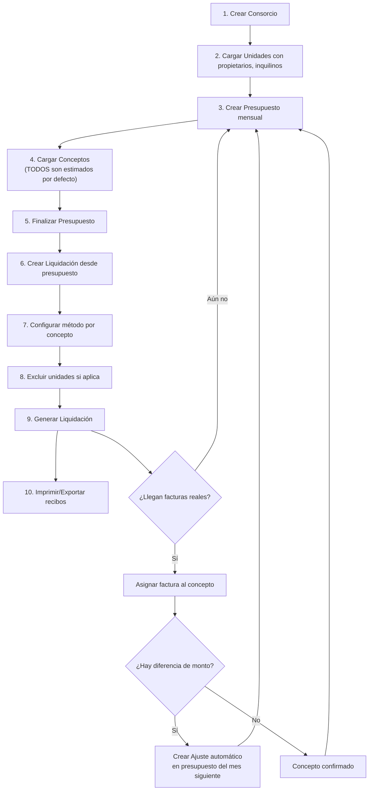
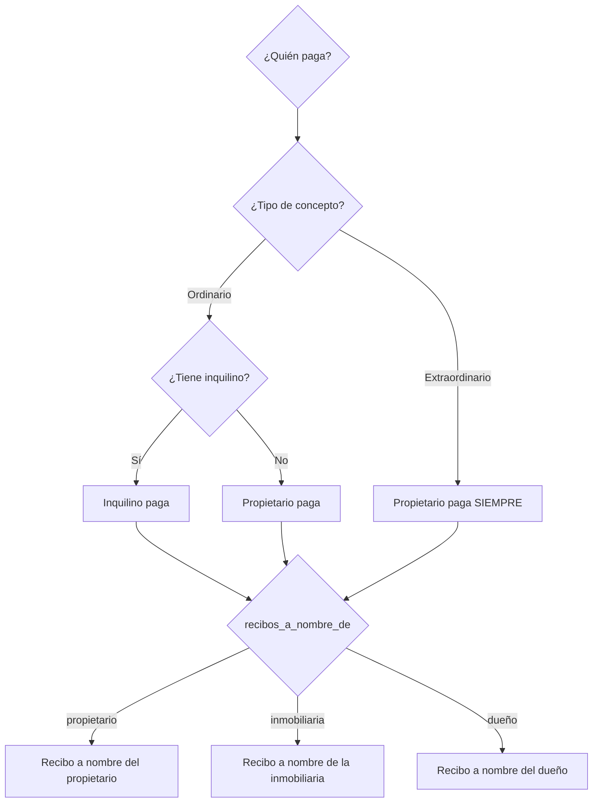

# ConsorciosPro — Reglas de Negocio y Flujos

**Versión:** 1.1
**Fecha:** 2026-03-23

---

## 1. Flujo Principal del Sistema



---

## 2. Reglas de Presupuestos

### 2.1 Creación
- Un presupuesto se crea para un consorcio + mes/año específico
- No pueden existir dos presupuestos para el mismo consorcio y período
- Estado inicial: `borrador`

### 2.2 Clonación del Mes Anterior
Cuando se genera un nuevo presupuesto:
1. Se busca el presupuesto del mes anterior del mismo consorcio
2. Se copian todos los conceptos con sus configuraciones
3. **Cuotas:** Si un concepto tiene `cuota_actual < cuotas_total`, se incrementa `cuota_actual`
4. **Cuotas terminadas:** Si `cuota_actual > cuotas_total`, el concepto **NO se copia**
5. **Ajustes automáticos:** Para cada concepto del mes anterior que recibió factura real (`monto_factura_real IS NOT NULL`), si hay diferencia con el monto estimado, se genera automáticamente un concepto "Ajuste [nombre]" con la diferencia
6. El concepto clonado conserva el monto estimado original (el usuario lo modifica según la nueva estimación del mes)

### 2.3 Ajustes por Estimados
```
Si monto_estimado = $1.000 y factura_real = $1.200:
  → Ajuste = +$200 (concepto nuevo en siguiente presupuesto)

Si monto_estimado = $1.000 y factura_real = $800:
  → Ajuste = -$200 (concepto de crédito/descuento en siguiente presupuesto)
```

### 2.4 Estados del Presupuesto
- **Borrador:** Se puede editar libremente
- **Finalizado:** No se puede editar. Listo para liquidar
- **Liquidado:** Se generó una liquidación. Inmutable

---

## 3. Reglas de Liquidación

### 3.1 Motor de Cálculo

Antes de calcular un concepto por coeficiente, el usuario selecciona el **conjunto de coeficientes** a utilizar (por ejemplo: Reglamento, Sin Locales, Cocheras).

#### Por Coeficiente
```
Para cada unidad participante en el concepto:
  coef_reprorrateado = coef_unidad / SUM(coef_todas_participantes)
  monto_unidad = monto_concepto × coef_reprorrateado

Verificación: SUM(monto_unidad) == monto_concepto (100%)
```

Reglas adicionales:
- Cada consorcio puede tener múltiples conjuntos de coeficientes nombrados.
- El conjunto por defecto es "Reglamento".
- Para gastos de cochera se puede usar conjunto "Cocheras".
- El conjunto elegido se guarda en la liquidación como snapshot.

**Ejemplo con exclusión:**
```
Unidades: A(3%), B(5%), C(2%) → Total: 10%
Si se excluye C del concepto "Ascensor" ($10.000):
  Coef reprorrateado A = 3 / (3+5) = 37.5%
  Coef reprorrateado B = 5 / (3+5) = 62.5%
  A paga: $10.000 × 0.375 = $3.750
  B paga: $10.000 × 0.625 = $6.250
  Total: $10.000 ✓
```

#### Por Partes Iguales
```
monto_unidad = monto_concepto / cantidad_unidades_participantes
```

#### Manual
```
Para cada unidad se define un porcentaje personalizado:
  monto_unidad = monto_concepto × (porcentaje_manual_unidad / 100)

Restricción: SUM(porcentaje_manual) debe ser EXACTAMENTE 100%
(El sistema debe validar esto antes de permitir guardar)
```

### 3.2 Generación de Recibos
- Concepto **ordinario** → Recibo dirigido al **inquilino** (o propietario si no hay inquilino)
- Concepto **extraordinario** → Recibo dirigido al **propietario** siempre
- El campo `recibos_a_nombre_de` de la unidad define a nombre de quién sale

### 3.3 Validaciones pre-liquidación
1. El presupuesto debe estar en estado `finalizado`
2. Todos los coeficientes de las unidades participantes deben sumar ~100% (con tolerancia de ±0.01)
3. No debe existir otra liquidación para el mismo consorcio y período
4. Cada concepto debe tener al menos 1 unidad asignada

---

## 4. Reglas de Gastos (parcial)

### 4.1 Flujo Digital Propuesto
1. Registrar gasto: proveedor, importe, período, factura adjunta
2. Asignar nro de orden automático o manual
3. Vincular con concepto del presupuesto (opcional)
4. Al pagar: registrar fecha de pago + comprobante adjunto
5. El sistema asigna mismo nro de orden a factura y pago
6. Estado cambia de `pendiente` a `pagado`

### 4.2 Integración con Presupuestos
- Cuando se vincula una factura/gasto a un concepto del presupuesto:
  - Se actualiza `monto_factura_real` en el concepto con el importe real de la factura
  - El concepto pasa de "estimado" a "confirmado" (tiene factura real asignada)
  - Al generar el presupuesto del mes siguiente, el sistema calcula automáticamente si hay diferencia y crea el concepto de ajuste correspondiente

### 4.3 Rubros y Rendición
- Cada concepto de presupuesto debe tener un `rubro` (servicios, mantenimiento, sueldos, impuestos, seguros, otros).
- El sistema debe permitir visualizar gastos agrupados por rubro para facilitar análisis.
- La rendición de gastos efectivamente pagados se presenta en módulo propio y **no** en el cupón.

---

## 5. Precedencia de Datos para Expensas



---

## 6. Reglas de Cupones SIRO

1. El cupón no detalla conceptos presupuestados.
2. Debe incluir nombre/logo de administración, datos del consorcio, CUIT, condición IVA y datos bancarios.
3. Debe incluir número SIRO, código de pago electrónico y código de barras.
4. Debe mostrar dos vencimientos:
   - `fecha_primer_vto` con monto base
   - `fecha_segundo_vto` con monto recargado
5. Cálculo de 2do vencimiento:
```
monto_segundo_vto = total_general * (1 + recargo_segundo_vto / 100)
```
6. La leyenda de medios de pago debe ser configurable por administración/consorcio.
